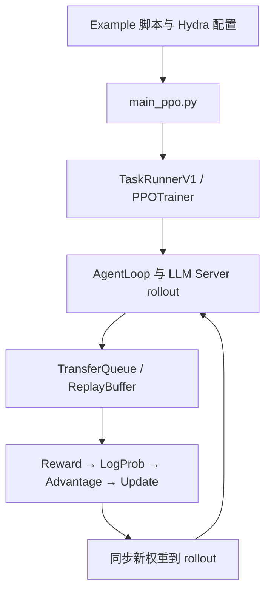

阅读 verl 最有效的方法，是沿着“一次完整训练”的调用链读，而不是从 `verl/` 目录逐文件看。建议先选 GRPO 示例，因为它没有 critic，比 PPO 少一条模型链路；理解整体后再补 PPO。

截至当前 `main` 分支，verl 正在使用新版 V1 Trainer，旧版 `RayPPOTrainer` 已标记为 deprecated。因此一些 v0.4 文档与当前代码会有差异：先确认 `trainer.use_v1`，当前默认是 `true`，默认模式是 `sync`。[当前配置](https://github.com/verl-project/verl/blob/main/verl/trainer/config/ppo_trainer.yaml)

## 一、先建立整体心智模型

verl 可以理解为四层：

| 层次 | 主要职责 | 关键位置 |
|---|---|---|
| 配置与入口 | Hydra 配置合成、启动 Ray、选择训练器 | `examples/`、`verl/trainer/main_ppo.py`、`verl/trainer/config/` |
| 控制与编排 | 描述 rollout、reward、advantage、更新模型的顺序 | `verl/trainer/ppo/v1/` |
| 分布式执行 | 管理 GPU、Ray Actor、WorkerGroup、资源池 | `verl/single_controller/` |
| 计算后端 | 真正进行生成、前向、反向、参数更新 | `verl/workers/engine/`、`verl/workers/rollout/` |

当前 V1 的主要运行流程是：



这体现了 verl/HybridFlow 的核心思想：driver 用比较直观的 Python 代码描述 RL 数据流，具体计算则通过 WorkerGroup 分发到远程 GPU worker。官方对 `WorkerGroup`、`ResourcePool`、注册装饰器的设计有专门说明。[single_controller 设计文档](https://verl.readthedocs.io/en/latest/single_controller.html)

## 二、项目目录结构

仓库根目录大致如下：[官方仓库](https://github.com/verl-project/verl)

```text
verl/
├── verl/                   # 核心 Python 包
├── examples/               # 官方最小化示例和启动脚本
├── recipe/                 # DAPO、PRIME 等研究型 recipe（Git submodule）
├── docs/                   # ReadTheDocs 文档源码
├── tests/                  # 单元、分布式、端到端测试
├── scripts/                # 环境、模型合并等辅助脚本
├── docker/                 # Docker 镜像
├── pyproject.toml
├── setup.py
└── requirements*.txt
```

`examples/` 是最合适的起点。它包含 PPO、GRPO、RLOO、ReMax、SFT、数据预处理等示例；复杂算法变体放在 `recipe/` 中。[examples 目录说明](https://github.com/verl-project/verl/tree/main/examples)

核心包 `verl/`：

```text
verl/
├── trainer/
│   ├── main_ppo.py             # RL 统一入口
│   ├── main_ppo_v0.py          # 旧版入口实现
│   ├── config/                 # Hydra 组合配置
│   └── ppo/
│       ├── core_algos.py       # GAE、GRPO、KL、policy loss 等
│       ├── reward.py
│       ├── ray_trainer.py      # 旧版训练器
│       └── v1/
│           ├── trainer_base.py
│           ├── trainer_sync.py
│           ├── trainer_colocate_async.py
│           ├── trainer_separate_async.py
│           ├── agent_loop_tq.py
│           └── replay_buffer.py
│
├── workers/
│   ├── engine_workers.py       # Actor/Critic/Ref worker RPC 接口
│   ├── engine/                 # FSDP、Megatron、VeOmni 等训练引擎
│   ├── rollout/                # vLLM、SGLang、TRT-LLM、HF rollout
│   ├── reward_manager/
│   └── config/
│
├── single_controller/
│   ├── base/                   # Worker、WorkerGroup 等抽象
│   └── ray/                    # Ray ResourcePool、RayWorkerGroup
│
├── protocol.py                 # DataProto 等数据交换协议
├── checkpoint_engine/          # 训练/推理权重同步及 checkpoint
├── models/                     # 模型相关实现
├── model_merger/               # 分片 checkpoint 合并
├── utils/
│   ├── dataset/
│   ├── reward_score/
│   ├── checkpoint/
│   ├── profiler/
│   └── ...
└── experimental/
```

训练引擎目前按后端分成 FSDP、Megatron、MindSpeed、VeOmni 等；rollout 则按 vLLM、SGLang、TRT-LLM 等拆分。[workers/engine](https://github.com/verl-project/verl/tree/main/verl/workers/engine)、[workers/rollout](https://github.com/verl-project/verl/tree/main/verl/workers/rollout)

## 三、推荐阅读顺序

### 1. 从一个 GRPO 启动脚本开始

例如选择：

```text
examples/grpo_trainer/run_qwen3_8b_fsdp.sh
```

第一遍只回答四个问题：

- Python 入口是不是 `verl.trainer.main_ppo`？
- `algorithm.adv_estimator` 设置成了什么？
- actor 使用什么训练后端？
- rollout 使用 vLLM、SGLang 还是其他后端？

不要一开始研究每个 batch-size 参数。

### 2. 阅读 Hydra 配置如何组合

先看：

```text
verl/trainer/config/ppo_trainer.yaml
```

它通过 defaults 组合 actor、critic、reference、rollout、model、reward 等子配置。重点追踪：

```text
actor_rollout_ref.actor
actor_rollout_ref.rollout
actor_rollout_ref.ref
critic
reward
algorithm
trainer
```

可以让 Hydra 输出最终配置：

```bash
python -m verl.trainer.main_ppo --cfg job --resolve
```

如果是从示例脚本学习，也可以先加 `set -x`，观察脚本最终传给 Hydra 的覆盖项。

### 3. 阅读总入口 `main_ppo.py`

当前调用链是：

```text
main()
  ├── auto_set_device()
  ├── validate_config()
  └── run_ppo()
       ├── ray.init()
       ├── TaskRunnerV1.remote()
       └── TaskRunnerV1.run()
            ├── get_trainer_cls()
            ├── trainer.init()
            ├── init_agent_loop_manager()
            └── trainer.fit()
```

源码中会根据 `trainer.use_v1` 选择 V1 或旧版路径。[main_ppo.py](https://github.com/verl-project/verl/blob/main/verl/trainer/main_ppo.py)

### 4. 阅读 V1 的训练主循环

最重要的文件是：

```text
verl/trainer/ppo/v1/trainer_base.py
```

建议按这个顺序找方法：

```text
PPOTrainer.__init__
PPOTrainer.init
PPOTrainer._setup
PPOTrainer.fit
PPOTrainer.step
PPOTrainer._step_once
```

其中 `_setup()` 创建：

- actor/reference/critic WorkerGroup
- LLM Server Manager
- Reward Loop Manager
- Checkpoint Engine Manager
- 数据集和资源池

`_step_once()` 最能表达算法数据流，当前大致顺序为：

1. 从 ReplayBuffer 取 rollout 数据
2. 计算 reward
3. 平衡各 DP rank 的 batch
4. 计算旧策略 `old_log_probs`
5. 可选计算 reference policy log-prob
6. PPO 时计算 critic values
7. 计算 advantage/return
8. PPO 时更新 critic
9. 更新 actor

这段主循环是理解整个项目的核心。[V1 trainer_base.py](https://github.com/verl-project/verl/blob/main/verl/trainer/ppo/v1/trainer_base.py)

### 5. 再深入算法公式

看：

```text
verl/trainer/ppo/core_algos.py
```

重点搜索：

```bash
rg "register_adv_est|compute_gae|compute_grpo|policy_loss|kl" \
  verl/trainer/ppo/core_algos.py
```

这里能看到：

- GAE advantage
- GRPO group-relative advantage
- RLOO、ReMax、REINFORCE++ 等 estimator
- KL controller
- 各类 policy loss

例如 GAE 与 GRPO 都通过注册机制接入，最终由 `algorithm.adv_estimator` 选择。[core_algos.py](https://github.com/verl-project/verl/blob/main/verl/trainer/ppo/core_algos.py)

### 6. 追踪一次真正的模型更新

从 `_update_actor()` 往下追：

```text
PPOTrainer._update_actor
  → actor_rollout_wg.update_actor(...)
  → ActorRolloutRefWorker.update_actor(...)
  → TrainingWorker.train_mini_batch(...)
  → 具体 model engine
```

`ActorRolloutRefWorker` 是一个关键抽象：同一组 GPU 上可以组合 actor、rollout、reference 等角色；`update_actor()` 最终调用训练引擎执行 mini-batch 反向更新。[engine_workers.py](https://github.com/verl-project/verl/blob/main/verl/workers/engine_workers.py)

之后只选一个后端读，例如你使用 FSDP，就只读：

```text
verl/workers/engine/fsdp/
```

先不要同时研究 FSDP 和 Megatron。

## 四、需要特别注意的两个版本差异

第一，旧版文档通常描述：

```text
main_ppo.py
→ RayPPOTrainer
→ DataProto
→ generate_sequences/update_actor RPC
```

这仍有助于理解 HybridFlow，但当前默认 V1 是：

```text
main_ppo.py
→ TaskRunnerV1
→ PPOTrainer
→ AgentLoop + TransferQueue + ReplayBuffer
```

旧版 `RayPPOTrainer` 已明确标记为计划移除。[旧版 RayPPOTrainer](https://github.com/verl-project/verl/blob/main/verl/trainer/ppo/ray_trainer.py)

第二，`DataProto` 仍是 verl 很重要的数据协议，封装 TensorDict、非 tensor 字段及 metadata；但阅读 V1 主循环时，还会大量看到 TransferQueue、`KVBatchMeta` 和 replay buffer。不要强行用旧版 `DataProto` 心智模型解释所有 V1 代码。[protocol.py](https://github.com/verl-project/verl/blob/main/verl/protocol.py)

## 五、按兴趣选择后续分支

| 你想理解什么 | 接下来重点读 |
|---|---|
| PPO/GRPO 数学实现 | `trainer/ppo/core_algos.py` |
| 完整训练控制流 | `trainer/ppo/v1/trainer_base.py` |
| 同步/异步训练区别 | `trainer_sync.py`、`trainer_*_async.py` |
| Ray 如何管理 GPU | `single_controller/base/`、`single_controller/ray/` |
| FSDP 训练细节 | `workers/engine/fsdp/` |
| Megatron 并行 | `workers/engine/megatron/` |
| vLLM/SGLang 生成 | `workers/rollout/` |
| 数据格式 | `utils/dataset/`、`examples/data_preprocess/` |
| 奖励函数 | `workers/reward_manager/`、`utils/reward_score/` |
| checkpoint 和权重同步 | `checkpoint_engine/` |
| 如何扩展算法 | `recipe/`、[扩展指南](https://verl.readthedocs.io/en/latest/extend_guide.html) |

一句话总结阅读主线：

```text
示例脚本
→ 最终 Hydra 配置
→ main_ppo.py
→ PPOTrainer.init/fit/_step_once
→ WorkerGroup RPC
→ Actor/rollout/critic 的具体 engine
→ core_algos 中的数学公式
```

先把这条链路完整走通一次，再读 `utils/` 和各种性能优化，效率最高。